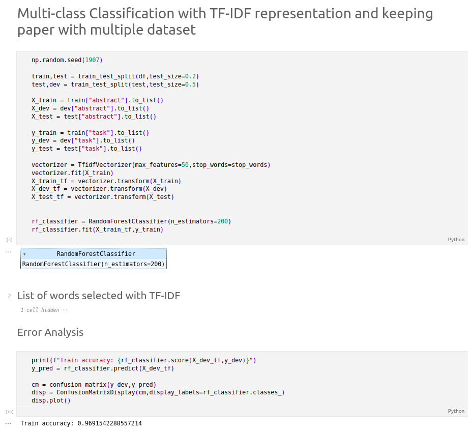

# Developer guide
This document is intented as a complement to ReadMe to show how to add new elements to the existing project with more visuals.

# Reference extraction
## Add a new paper/dataset to monitor:

1. Add a new entry in data/datasets.csv like as follow: title,DOI,organ like shown below

Location             |  Content
:-------------------------:|:-------------------------:
  |  

2. Rerun extract_papers_*.ipynb files 

See the new results in results/extracted.csv

Location             |  Content
:-------------------------:|:-------------------------:
  |  

## Add a new source:
1. To add a new source to be merge with other in fusion_sources.ipynb you just have to produce a csv named papers_{source_name}.csv with the same structure as others (name,DOI,publication_year,dataset_used) and put it in results/extracted_csv

2. Rerun fusion_sources.ipynb 

the result will be in processed_csv/merged.csv:

Location             |  Content
:-------------------------:|:-------------------------:
  |  

# Create/Update abstract dataset

## With OpenAlex references:
1. (Optionnal) Rerun OpenAlex references extraction to update the list
2. Rerun the following 2 cells in code/task_classification/create_dataset.ipynb to create the dataset

Location             |  Content
:-------------------------:|:-------------------------:
  |  

The result will be in data/abstract_dataset

Location             |  Content
:-------------------------:|:-------------------------:
  |  

## Using abstract:
1. Rerun the following cells

Location             |  Content
:-------------------------:|:-------------------------:
  |  

The result will be in data/abstract_dataset

Location             |  Content
:-------------------------:|:-------------------------:
  |  

## To add a new keyword to search for in abstract
1. Add the new keyword in data/keywords.csv with keyword,organ

Location             |  Content
:-------------------------:|:-------------------------:
  |  

2. Rerun the same cells as above

The result will be at the same place

# Classification
To run and test the classification of abstract launch the following cells in task_classification/abstract_classification.ipynb

Location             |  Content
:-------------------------:|:-------------------------:
  |  
