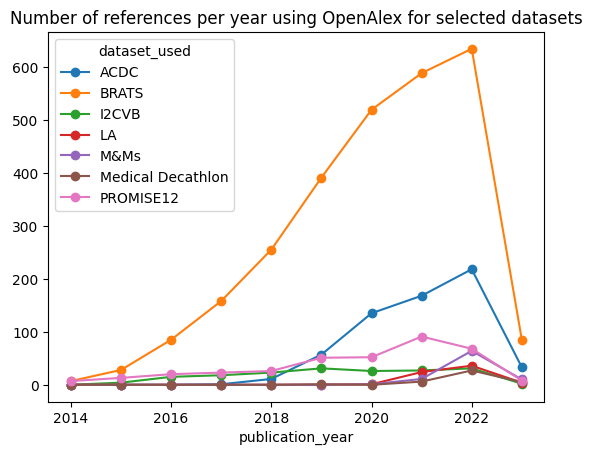
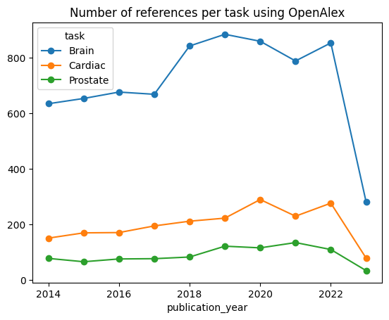
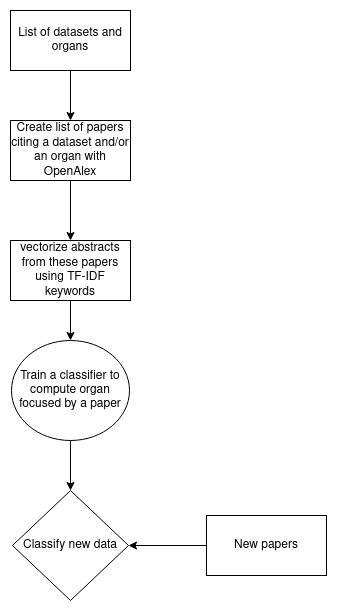
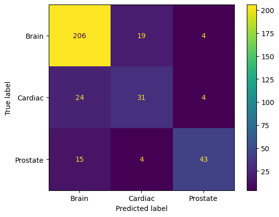
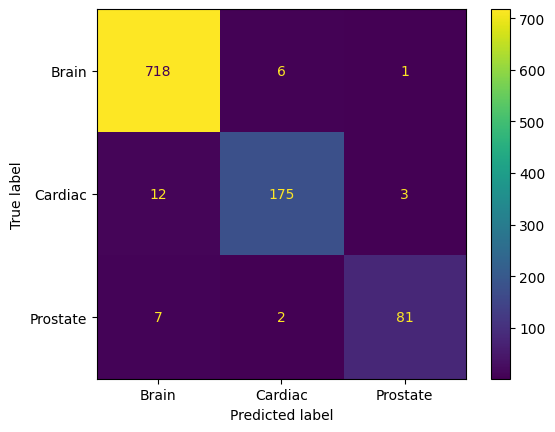

# Public Dataset Project Sourget Théo

# Table Of Content
1. [Objectives of the project](#objectives)
2. [Extraction of references](#references-extraction)
3. [Paper task classification](#classification)
4. [Possible improvements](#futur)

# Main Idea of the Project:

The main goal of the project is to study the usage of datasets in medical image segmentation papers to determine if there is an over or under representation of some of them and the organ they are about.
To do so, we try to get the papers referencing datasets but also classify the organ targeted by a paper using its abstract.

# Extraction of References:
Using a first selection of 5 papers, we have established a list of datasets to monitor during the project. We then try to obtain the list of paper using these datasets.

### Multiple existing tools:
* Free API: [OpenAlex](https://opencitations.net/), [OpenCitation](https://opencitations.net/)
* Not so free API: [dimensions.ai](https://www.dimensions.ai/)
* No official API: [Google scholar](https://scholar.google.com/)

### Comparison of coverage:

From this figure we showed that OpenAlex seems to be the more complete API so we used it for the rest of the project.

### Extraction of references results:

### Number of papers per organ:

# Task Classification:
Instead of focusing on dataset, focus on task.
To do so:
1. Create a dataset of abstract and task associated
2. Search for discriminative keywords in abstract (TF-IDF)
3. Classify the histogram of keywords in new abstract using Random Forest

To summarize, we have the following pipeline for the project:

We have two version of the dataset, using different sources of papers
### First version of dataset using papers from references extraction 

### Second version using papers tagged as "Segmentation" and "Machine Learning" by OpenAlex which cite an organ or a dataset in the abstract

# Possible Improvements
1. Increase datasets/organs used (exemple from grand-challenge.org)

| Anatomical Region | Anatomical structures                     |
|-------------------|-------------------------------------------|
| Abdomen           | Colon,Kidney,Liver,Pancreas,Spleen        |
| Cardiac           | <b>Heart</b>                              |
| Head and Neck     | <b>Brain</b>,Cranium,Retina,Teeth         |
| Lower Limb        | Knee                                      |
| Pelvis            | Cervix, <b>Prostate</b>                   |
| Skin              | Skin                                      |
| Spine             | Spinal Cord,Vertebral Column              |
| Thorax            | Breast,Lung                               |
| Upper Limb        | Hand                                      |
2. Make our custom dataset more difficult and complete
3. Try to classify using full-text (figures/tables of results)

# Useful Papers
* [Google Scholar, Microsoft Academic, Scopus, Dimensions,
Web of Science, and OpenCitations’ COCI: a multidisciplinary
comparison of coverage via citations](https://link.springer.com/content/pdf/10.1007/s11192-020-03690-4)

* [A New Random Forest Method for One-Class Classification](https://link.springer.com/chapter/10.1007/978-3-642-34166-3_31)

* [Transfer Learning in Biomedical Natural Language Processing: An Evaluation of BERT and ELMo on Ten Benchmarking Datasets](https://arxiv.org/abs/1906.05474)