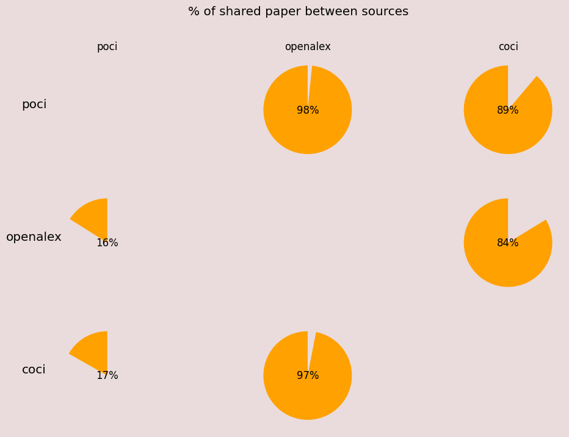
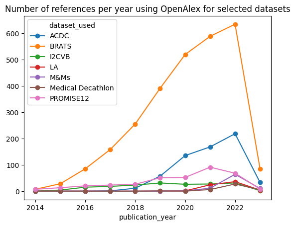
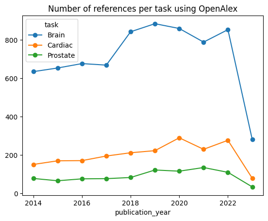
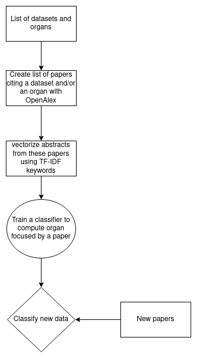
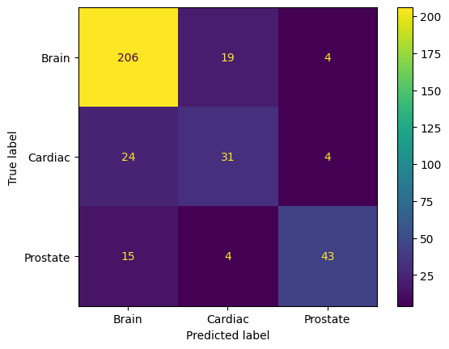
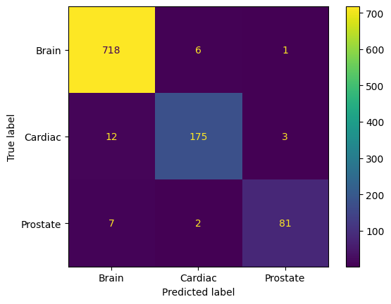

# Public Dataset Project Sourget Théo

# Table Of Content
1. [Objectives of the project](#objectives)
2. [Extraction of references](#references-extraction)
3. [Paper task classification](#classification)
4. [Possible improvements](#futur)

# Main Idea of the Project:

The main goal of the project is to study the usage of datasets in medical image segmentation papers to determine if there is an over or under representation of some of them and the organ they are about.
To do so, we try to get the papers referencing datasets but also classify the organ targeted by a paper using its abstract.

# Extraction of References:
Using a first selection of 5 papers, we have established a list of datasets to monitor during the project. We then try to obtain the list of paper using these datasets.

### Multiple existing tools:
* Free API: [OpenAlex](https://opencitations.net/), [OpenCitation](https://opencitations.net/)
* Not so free API: [dimensions.ai](https://www.dimensions.ai/)
* No official API: [Google scholar](https://scholar.google.com/)

### Comparison of coverage:
We query each free API to retrieved paper citing one of the dataset we monitor and obtained a csv of references in which each line is formatted as follow:

        name,DOI,publication_year,dataset_used

exemple of line:

        nnU-Net: a self-configuring method for deep learning-based biomedical image segmentation,10.1038/s41592-020-01008-z,2021,ACDC

We can then compare the coverage of each API by looking at the amount of shared papers between two API, in this figure a paper is considered as shared if it's returned by two API (i.e if it references AT LEAST ONE of the datasets we monitor and even if it's not the same between the APIs)

From this figure, we showed that OpenAlex seems to be the most complete API so we used it for the rest of the project.

### Extraction of references results:
We can use the previous reference extraction to compare the number of references of papers 

### Number of papers per organ:

We can also compute the number of paper focusing on an organ by looking in their abstract for keywords such as "cardiac","acdc" or "brain" (see below in the second version of the dataset for more information on the data)

# Task Classification:
Instead of focusing on dataset, focus on task.
To do so:
1. Create a dataset of abstract and task associated
2. Search for discriminative keywords in the abstracts (TF-IDF)
3. Classify the histogram of keywords in new abstract using Random Forest

To summarize, we have the following pipeline for the project:

We have two versions of the dataset, using different sources of papers. In both version, a line of the datasets if formatted as follow:

        title,doi,publication_year,abstract,task

exemple of line:

        Brain Tumor Segmentation Using U-Net,https://doi.org/10.1007/978-981-19-6880-8_16,2023,"abstractbrain tumor segmenting from ...",Brain

### First version using papers from reference extraction :
In this first version, we use the list obtained with references extraction to query OpenAlex to get the abstract of a paper and the ground truth organ of this paper is chosen according to the dataset paper it cites. For exemple if a dataset is referencing ACDC paper then the groundtruth will be "Cardiac", if it references BRATS then the groundtruth will be "Brain", and finally if it references multiple datasets it will create a line in the dataset for each references (one where the class will be "Cardiac" and one where the class will be "Brain" for exemple) 

This dataset of abstract isn't well formed because some papers cite one of the dataset we monitor but are not using it so our dataset contains lot of false groundtruth

We split the dataset into train and valid and obtain the following results with a RandomForest of 200 Decision Tree

We can see that the Brain class, which is the majority class by far is classified well, but the two others present lot of errors with confusion as Brain

### Second version using papers tagged as "Segmentation" and "Machine Learning" by OpenAlex which cite an organ or a dataset in the abstract :

As the first dataset is not precise enough to get the groundtruth we try to create a second one. To do so, we query OpenAlex to get papers related to "Machine Learning" and "Segmentation" as a first filtering and then we check their abstract for simple keywords such as "Cardiac","Brain", "Prostate" and some datasets name such as "ACDC","BRATS" if a paper contains one of the word it is added to our dataset and the groundtruth depends on the words detected. Again if multiple words are detected a line per organ is created.

We follow the same protocol as before to train a RandomForest and obtain the following results:

We can see that the results are way better and some errors are actually caused by paper focusing on multiple organs. However this dataset seems too "simple" because it gathered "obvious" exemples.

### Conclusion :

The first version is not clean enough to be used to train a model and the second one seems too 'simple'. An in-between the two could be good.

# Possible Improvements
1. Increase datasets/organs used (example from [grand-challenge.org](https://grand-challenge.org/challenges/))

| Anatomical Region | Anatomical structures                     |
|-------------------|-------------------------------------------|
| Abdomen           | Colon,Kidney,Liver,Pancreas,Spleen        |
| Cardiac           | <b>Heart</b>                              |
| Head and Neck     | <b>Brain</b>,Cranium,Retina,Teeth         |
| Lower Limb        | Knee                                      |
| Pelvis            | Cervix, <b>Prostate</b>                   |
| Skin              | Skin                                      |
| Spine             | Spinal Cord,Vertebral Column              |
| Thorax            | Breast,Lung                               |
| Upper Limb        | Hand                                      |
2. Make our custom dataset more difficult and complete
3. Try to classify using full-text (figures/tables of results)

# Useful Papers
* [Google Scholar, Microsoft Academic, Scopus, Dimensions,
Web of Science, and OpenCitations’ COCI: a multidisciplinary
comparison of coverage via citations](https://link.springer.com/content/pdf/10.1007/s11192-020-03690-4)

* [A New Random Forest Method for One-Class Classification](https://link.springer.com/chapter/10.1007/978-3-642-34166-3_31)

* [Transfer Learning in Biomedical Natural Language Processing: An Evaluation of BERT and ELMo on Ten Benchmarking Datasets](https://arxiv.org/abs/1906.05474)